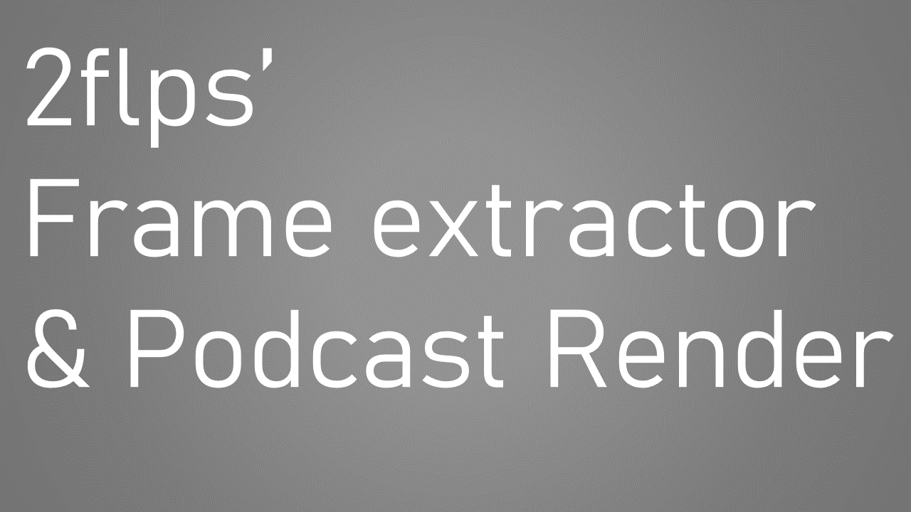

# :video_camera: 2flps' Podcast Render :film_projector:

2flps' Podcast Render is a program for rendering podcast using Python and Java, while the members are talking in a Discord call.

## 1. Requirements

- A screen recorder (I would recommend [OBS](https://obsproject.com/welcome))
- [Discord](https://discord.com/)
- A footage of a Discord conversation inside a voice channel
- [Java](https://www.java.com/) (for the Frame Extractor)
- [Python](https://www.python.org/) (for the main script)

### 1.1 Dependencies

For Java:
- [BoofCV FFmpeg](https://mvnrepository.com/artifact/org.boofcv/boofcv-ffmpeg/0.38)

For Python:
- [Pillow](https://pypi.org/project/Pillow/)
- [MoviePy](https://pypi.org/project/moviepy/)

## 2. How to use

Well, I made a video explaining how to use it. Just click on the picture below, and you'll be directed to the YouTube video.

## FAQ

1. Why did you make this program?
- As I said in the video, my teacher gave me a homework: "folks, let's make a podcast. Band together with your friends, pick a theme and record it", but I was afraid that our voices would sound kinda similar, so I decided to do this to help him understand who is currently speaking.
2. The program is not portable
- Again, as I said in the video, the deadline of the homework is getting closer, so I decided to "rush" a bit, sacrificing some portability.
3. I just want to download the Frame Extractor
- You can download it separated from the other files in my GitHub repository.
4. "I found a bug" or "I don't know how to use this"
- You can open an issue ticket here on GitHub or reach me on my e-mail: felipeflohrlol@gmail.com
